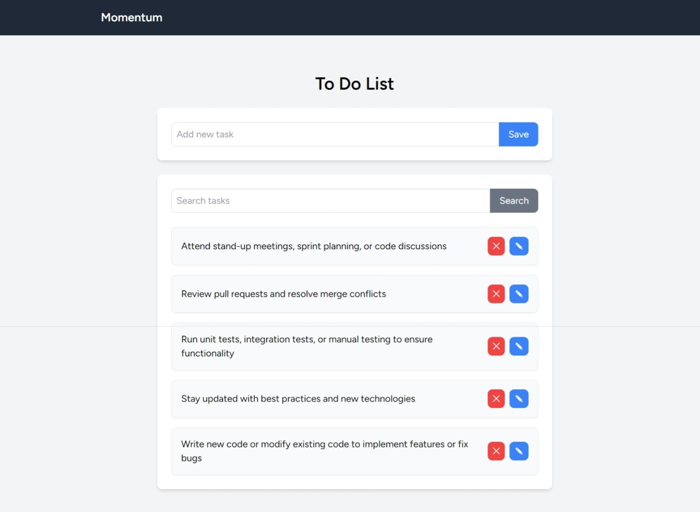

# Momentum App
To do manager app

## Overview

**Momentum** is a simple and efficient task management web application designed to help users organize their daily tasks. With an intuitive interface, users can add, update, delete, and search tasks effortlessly. Built using Laravel and Tailwind CSS, Momentum provides a seamless and responsive experience.

## Features.

## Screenshots

<div style="display: flex; justify-content: space-between;">
    
</div>

## Features

- ✅ **Add Task** – Quickly add new tasks to your list.
- ✏️ **Update Task** – Modify existing tasks to keep them up to date.
- ❌ **Delete Task** – Remove tasks that are no longer needed.
- 🔍 **Search Task** – Find tasks easily using a search functionality.

## Installation

To get started with the **Momentum** backend, follow these steps:

1. **Clone the repository:**

    ```bash
    git clone https://github.com/muhammadderic/momentum.git
    cd momentum
    cd backend
    ```

2. **Install dependencies:**

    ```bash
    npm install
    ```

3. **Setup environment:**
    configure your .env file (look at .env.example file)

4. **Run migrations:**

    ```bash
    php artisan migrate
    ```

5. **Run the development server:**

    ```bash
    php artisan serve
    ```

    Visit [http://localhost:8000/todo](http://localhost:8000/todo) in your browser to see the app in action.

## Technologies Used

- **Laravel** – Backend framework for handling business logic and database operations.
- **Tailwind CSS** – Utility-first CSS framework for responsive and modern styling.

## Contact

If you have any questions or suggestions, feel free to reach out:

- **GitHub**: [muhammadderic](https://github.com/muhammadderic)